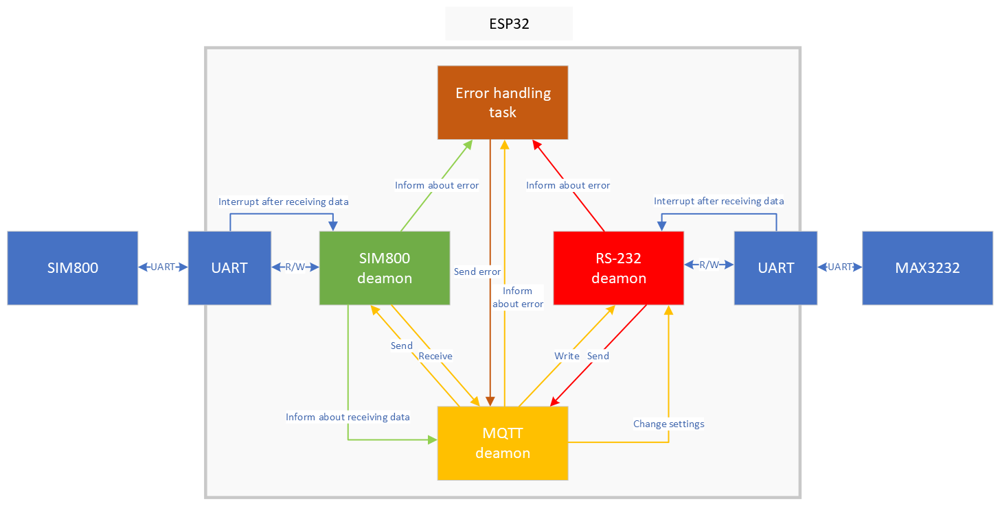

# RS-232 remote access - Remote device
This branch contains remote embedded device part of the project.

Access to RS232 in remote location is done by a device created specifically for this purpose.
It communicates with client application through server using MQTTv5.
The TCP tunnel between the device and the server is secured using TLS1.3.

## Software
The devices program was written in C using ESP-IDF framework (non-arduino style), which utilizes uses FreeRTOS real time system.
FreeRTOS allows to conveniently create threads and provides a simple API to communicate them with each other. 

The microcontroller software uses four main threads:
- Error handling task - receives errors sent from other tasks and, based on them, decides whether to restart the task or reboot the entire device.
- SIM800 deamon - a low-level driver for the SIM800 module.
- MQTT deamon - task responsible for handling communication with the server using the MQTT protocol and howling received commands.
- RS323 demaon - handling communication via RS232 port.

The following illustration shows the communication between tasks and communication interfaces in a simplified way.

Additional information about software can be found in [shortened device documentation](./readme_resources/shortened_doc_pl.pdf).
Additional information about SIM800 library can be found in [shortened sim800 library documentation](./readme_resources/sim800_lib_doc_pl.pdf).

### Libraries and tools
The device is written in C language with ESP-IDF framework.
Libraries and main utilities used:
- ESP-IDF built-in functions,
- FreeRTOS,
- [Mbed-TLS](CMakeLists.txt),
- [Paho MQTT C/C++ Embedded](https://github.com/eclipse/paho.mqtt.embedded-c/tree/mqttv5) - repository branch with MQTTv5 compliance,
- made from scratch C library for SIM800 module, which allows handling data from TCP connections 

### Project structure
Libraries discussed above can be found in [components folder](./components/):
- [mbedtls_sim800](./components/mbedtls_sim800/) - implements data encryption with Mbed TLS library instead of using build-in SIM800 encryption (no TLSv1.3 support),
- [MQTT-Packet](./components/MQTTPacket/) - low-level part of Paho MQTT C/C++ Embedded, containing only simplest definitions and functions needed to use MQTT protocol,
- [sim800l](./components/sim800l/) - library for SIM800 module.
Libraries were adopted to format required by ESP-IDF - i.e. proper "CMakeLists.txt" files were added.

Main loop and threads' definitions are located in [main folder](./main/).

### Additional utilities
Additionally, in order to upload TLS trusted certificates using [PowerShell script](./resources/settings/device_cert_installer.ps1) two tools are needed:
- [esptool](https://github.com/espressif/esptool) - a utility to communicate with the ROM bootloader in Espressif chips.
It should be placed in [settings folder](./resources/settings/), named esptool.exe
- [mkspiffs](https://github.com/igrr/mkspiffs) - a tool to build and unpack SPIFFS images ([a file system](https://github.com/pellepl/spiffs) supported by ESP32).
It should be placed in [settings folder](./resources/settings/), named mkspiffs.exe

## Hardware
The device consists of the following components:
- ESP-WROOM-32- microcontroller mounted on a development board compatible with ESP32-DevKit, the main unit.
- SIM800l- a GPRS communication module.
- MAX3232- actually a module with MAX3232 voltage converter from TTL standard to RS232 standard.
- MP1584- module with step-down voltage converter MP1584en.

The connection diagram of the device modules can be seen below:

