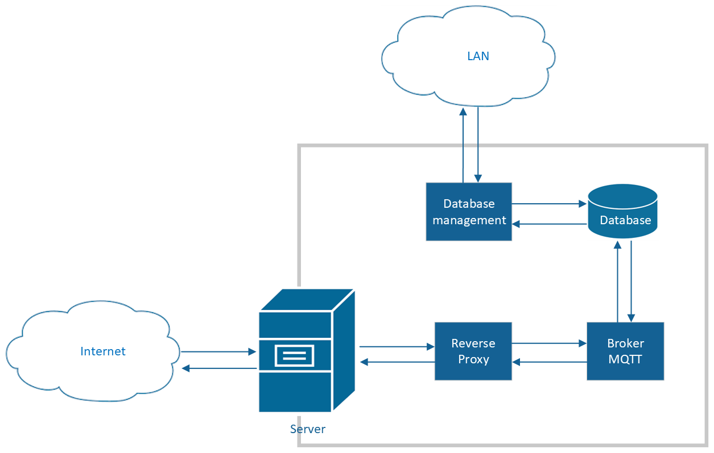

# RS-232 remote access - Server
This branch contains server part of the project.

The server has been implemented in a microservices manner using Docker Compose.
This gives the possibility of logical separation of individual functions and allows simple implementation of the server.
Also, in the event of a possible expansion of the server's capabilities with little effort.

In order to allow devices to connect to server it has to be accessible via Internet (public IP/DNS/DDNS).

## Structure

The containers used and their functionalities are listed below:

### 1. Reverse proxy
A module responsible for encrypting data and distributing traffic among the other microservices. 
For module to work properly it needs access to server public and private keys.
Implemented with [Openresty cotainer](https://hub.docker.com/r/openresty/openresty).

### 2. Database
Stores information about all users of the system, such as login, password, permissions.
Database has to initialized before use with [SQL script](./db/resources/db.sql).
Utilizes [MySQL container](https://hub.docker.com/r/openresty/openresty).

### 3. MQTT Broker
A MQTT server, supporting MQTT v5.0. It has access to the database in order to authentication and authorization of users.
Implemented with [Mosquitto Go Auth container](https://hub.docker.com/r/iegomez/mosquitto-go-auth), which is Mosquitto broker with advanced authentication capabilities.

### 4. Database management interface
Allows adding/deleting/modifying user accounts. 
Accessible only locally.
Implemented with [Adminer container](https://hub.docker.com/_/adminer)
